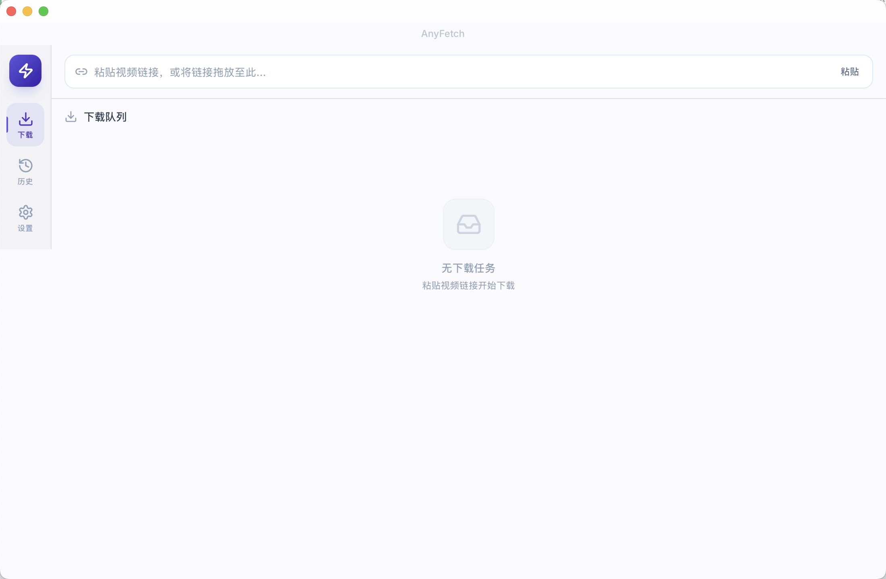
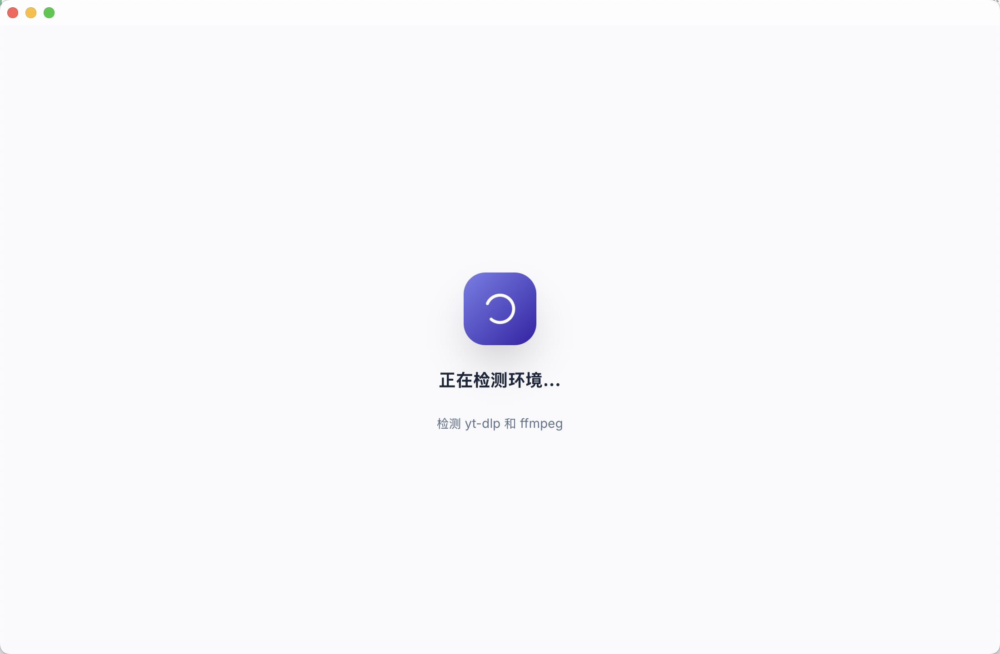

# 🚀 AnyFetch

<p align="center">
  
</p>

<p align="center">
  <strong>一款基于 <a href="https://github.com/yt-dlp/yt-dlp">yt-dlp</a> 的现代音视频下载器，为您提供极速、流畅的下载体验。</strong>
</p>

<p align="center">
  
  
  
  
  
</p>

---

## ✨ 核心特性

- **⚡ 强大的引擎支持**：底层基于 `yt-dlp`，支持全球数千个主流视频网站的音视频提取。
- **📺 播放列表解析**：不仅支持单视频链接，还能一键解析并批量下载完整的播放列表（Playlist）。
- **🎨 现代极简 UI**：采用现代视觉设计规范，提供拖拽链接下载、明亮/暗色模式自适应的高端操作体验。
- **🍪 智能 Cookie 导入**：
  - **支持自动读取谷歌浏览器 (Google Chrome) 的登录 Cookies**，实现便捷解析，省去手动导出的繁琐步骤。
  - 支持手动导入 Netscape 格式的 `cookies.txt` 文件，方便下载需要身份验证的内容。
- **🛠️ 一键依赖检测与自愈**：应用在启动时将自动检测系统 `yt-dlp` 与 `ffmpeg` 的可用状态。若缺失 `yt-dlp`，支持在界面一键自动从 GitHub 下载安装与版本更新。
- **🎵 格式与音频转换**：支持多种画质（最佳质量、1080p、720p 等）选择，内置 `ffmpeg` 格式合并，并支持一键提取音轨转换为高质量 MP3。
- **📊 任务并发管理**：多任务并行下载、实时展示速度、ETA（剩余时间）以及任务完成的历史记录管理。

## 📸 界面预览

| 📥 主界面解析与下载 | ⚙️ 设置与依赖检测 |
| :---: | :---: |
|  |  |

---

## 🛠️ 安装与运行环境

### 1. 系统依赖

- **yt-dlp**：负责视频抓取与解析。如果系统未安装，AnyFetch 支持在软件初次启动时为您**自动下载安装**到本机的 `~/.local/bin/yt-dlp` 目录。
- **ffmpeg**：用于高画质视频片段的音视频流合并及格式转换。
  - macOS 推荐使用 Homebrew 安装：
    ```bash
    brew install ffmpeg
    ```

---

## 💻 本地开发与构建

如果您希望在本地编译或调试 AnyFetch，请确保您的电脑已配置好 **Rust** 和 **Node.js** 的开发环境。

### 依赖环境

1. **Rust**：Tauri 2 依赖 Rust 编译器。
   ```bash
   curl --proto '=https' --tlsv1.2 -sSf https://sh.rustup.rs | sh
   ```
2. **Node.js / pnpm**：推荐使用 pnpm 作为前端包管理器。
   ```bash
   npm install -g pnpm
   ```

### 开发步骤

1. **克隆仓库**：
   ```bash
   git clone https://github.com/onlw/AnyFetch.git
   cd AnyFetch
   ```
2. **安装前端依赖**：
   ```bash
   pnpm install
   ```
3. **拉起开发服务器 (Hot-Reload)**：
   ```bash
   pnpm tauri dev
   ```

### 生产打包

生成适用于 macOS 的独立原生应用包（`.app` / `.dmg`）：

```bash
pnpm tauri build
```

---

## 💡 常见问题与提示 (FAQ)

#### Q: 如何下载需要登录（如超清/会员）的视频？

**A**：AnyFetch 提供了两种快捷方式：

- **方式一（推荐）**：确保您本地的 Google Chrome 浏览器已登录对应网站账号。AnyFetch 在解析时能自动读取 Chrome 的 Cookie 登录状态，无需额外操作即可获取超清画质。
- **方式二**：使用浏览器扩展将 Cookie 导出为 `cookies.txt`，在 AnyFetch 的 **【设置】** -> **【Cookies 文件】** 栏中导入即可。

#### Q: 下载好的高画质视频只有声音或没有画面？

**A**：`yt-dlp` 抓取超清（1080p及以上）视频时，音频和视频流是分开下载的。如果您的电脑没有配置 `ffmpeg`，将无法自动合成单文件。请确保您已经通过命令 `brew install ffmpeg` 安装了 `ffmpeg`，以便 AnyFetch 能够自动调用其进行无损音视频流拼合。

---

## 📜 许可证

本项目基于 **MIT License** 许可协议开源。
